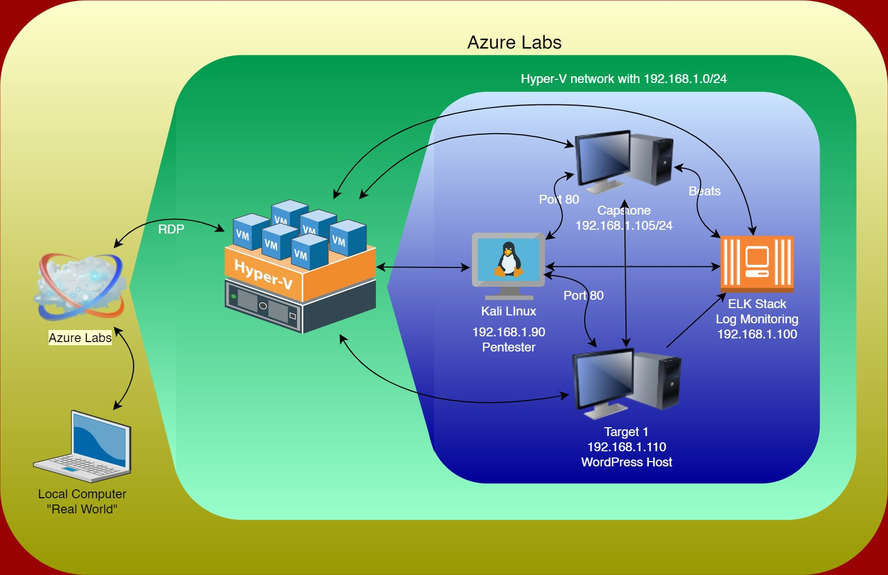

# **Blue Team: Summary of Operations**

## **Table of Contents**

* Network Topology
* Description of Targets
* Monitoring the Targets
* Patterns of Traffic & Behavior
* Suggestions for Going Further

### **Network Topology**

The following machines were identified on the network:

* Kali
    * **Operating System**: Debain Kali 5.4.0
    * **Purpose**: Pen Tester
    * **IP Address**: 192.168.1.90
* Capstone
    * **Operating System**: Ubuntu 20.04.4
    * **Purpose**: Vulnerable Web Server
    * **IP Address**: 192.168.1.105
* Elk
    * **Operating System**: Ubuntu 18.04
    * **Purpose**: Kibana Stack
    * **IP Address**: 192.168.1.100
* Target 1
    * **Operating System**: Debian GNU/Linux 8
    * **Purpose**: Wordpress Host
    * **IP Address**: 192.168.1.100

### **Description of Targets**

The target of this attack was: Target 1 **192.168.1.110/24**

Target 1 is an Apache web server and has SSH enabled, so ports 80 and 22 are possible ports of entry for attackers. As such, the following alerts have been implemented:

### **Monitoring the Targets**

Traffic to these services should be carefully monitored. To this end, we have implemented the alerts below:

#### **Name of Alert 1**

**Excessive HTTP Errors**

Alert 1 is implemented as follows:

* **Metric**: _WHEN count() GROUPED OVER top 5 ‘http.response.status_code’_
* **Threshold**: _IS ABOVE 400_
* **Vulnerability Mitigated**: _Enumeration/Brute Force_
* **Reliability**: There is a high degree of reliability in the alert. Measuring by error codes 400 and above will filter out any normal or successful responses. In addition to 400+ codes, there are also client and server errors that are of greater concern. Especially when taking into account these error codes going off at a high rate.

**HTTP Request Size Monitor**

Alert 2 is implemented as follows:

* **Metric**: WHEN sum() of http.request.bytes OVER all documents
* **Threshold**: _IS ABOVE 3500_
* **Vulnerability Mitigated**: Code injection in HTTP requests (XSS and CRLF) or DDOS
* **Reliability**: Alert could create false positives. It comes in at a medium reliability. There is a possibility for a large non malicious HTTP request or legitimate HTTP traffic.

#### **CPU Usage Monitor**

Alert 3 is implemented as follows:

* **Metric**: _WHEN max() OF system.process.cpu.total.pct OVER all documents_
* **Threshold**: _IS ABOVE 0.5_
* **Vulnerability Mitigated**: _Malicious software, programs (malware or viruses) running taking up resources_
* **Reliability**: _The alert is highly reliable. Regardless of whether a malicious program is running, this can still reveal where CPU usage can be improved._

### 

### **Suggestions for Going Further (Optional)**

* Each alert above pertains to a specific vulnerability/exploit. Recall that alerts only detect malicious behavior, but do not stop it. For each vulnerability/exploit identified by the alerts above, suggest a patch. E.g., implementing a blocklist is an effective tactic against brute-force attacks. It is not necessary to explain _how_ to implement each patch.

The logs and alerts generated during the assessment suggest that this network is susceptible to several active threats, identified by the alerts above. In addition to watching for occurrences of such threats, the network should be hardened against them. The Blue Team suggests that IT implement the fixes below to protect the network:

* Vulnerability 1
    * **Patch**: : E.g., _install special-security-package with apt-get_
    * **Why It Works**: : E.g., _special-security-package scans the system for viruses every day_
* Vulnerability 2
    * **Patch**: : E.g., _install special-security-package with apt-get_
    * **Why It Works**: : E.g., _special-security-package scans the system for viruses every day_
* Vulnerability 3
    * **Patch**: : E.g., _install special-security-package with apt-get_
    * **Why It Works**: : E.g., _special-security-package scans the system for viruses every day_
