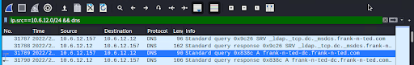
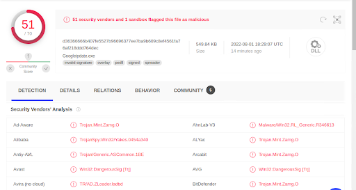
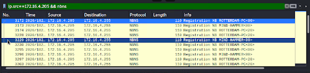
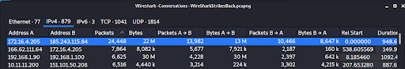
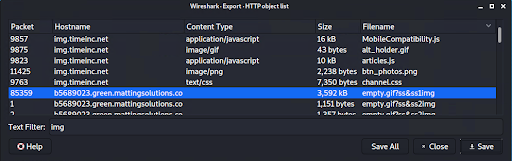
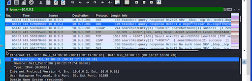
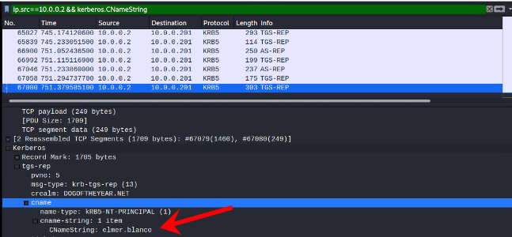
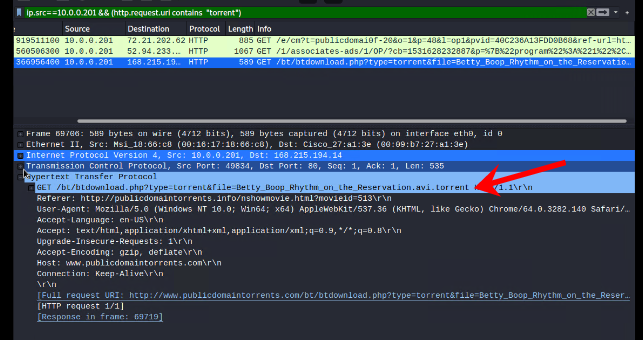

# **Network Forensic Analysis Report**

## **Time Thieves**

You must inspect your traffic capture to answer the following questions:

>>>>>  gd2md-html alert: inline image link here (to images/image1.png). Store image on your image server and adjust path/filename/extension if necessary.  (<a href="#">Back to top</a>)(<a href="#gdcalert2">Next alert</a>) >>>>> 

1. What is the domain name of the users' custom site? frank-n-ted.com
2. What is the IP address of the Domain Controller (DC) of the AD network? 10.6.12.12
3. What is the name of the malware downloaded to the 10.6.12.203 machine? june11.dll
    * Once you have found the file, export it to your Kali machine's desktop. 
4. Upload the file to[ VirusTotal.com](https://www.virustotal.com/gui/).
5. What kind of malware is this classified as? Looks like a Trojan mostly

---

## 

## **Vulnerable Windows Machine**

1. Find the following information about the infected Windows machine:
    * Host name ROTTERDAM-PC
    * IP address 172.16.4.4
    * MAC address 00:59:07:b0:63:a4  
  

  
2. What is the username of the Windows user whose computer is infected?  
This website offered Windows user account from from Kerberos traffic  https://unit42.paloaltonetworks.com/using-wireshark-identifying-hosts-and-users/  
So, the username is: matthijs.devries

3. What are the IP addresses used in the actual infection traffic?  
	185.243.115.84  

4. As a bonus, retrieve the desktop background of the Windows host.  
Hackertarget.com gives a cheetsheet on finding an image, There were only a few files that were worth considering because of the size of the files. This one actually looks like a screenshot of a desktop  

---

## 

## **Illegal Downloads**

1. Find the following information about the machine with IP address 10.0.0.201:  
    * MAC address 00:16:16:18:66:c8  
      
    * Windows username elmer.blanco  
      
    * OS version Window NT 10.0  
        
      
2. Which torrent file did the user download?  
    * Betty_Boop_Rhythm_on_the_Reservation.avi.torrent  
        
