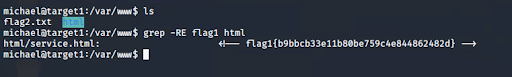
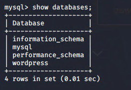
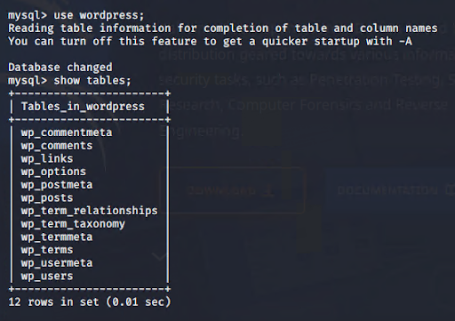
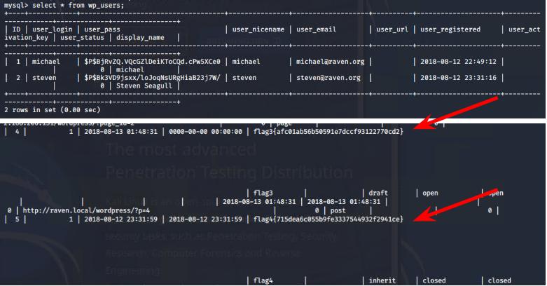

# **Offensive Report:**

## **Red Team: Summary of Operations**

### **Table of Contents**

* Exposed Services
* Critical Vulnerabilities
* Exploitation**Exposed Services**

Nmap scan results for each machine reveal the below services and OS details:

This scan identifies the services below as potential points of entry:

* Target 1
    * ssh
    * http
    * rpc services
    * netbios-ssn

The following vulnerabilities were identified on each target:

* Target 1
    * Ssh
        * CVE-2002-1645 score 10.0
        * Attackers execute arbitrary code via long URL
    * Http 
        * CVE-2022-31813 score 7.5
        * This may be used to bypass IP based authentication on the origin server/application.
    * SMB vulnerabilities
        * CVE-2020-1472 score 10.0 Elevation of privilege
        * CWE-287: Improper Authentication
        * CVE-2021-44142 Complete CIA impact
    * rpcbind only has normal vulnerabilites

### **Exploitation**

The Red Team was able to penetrate Target 1 and retrieve the following confidential data:

* Target 1
    * flag1.txt: _flag1{b9bbcb33e11b80be759c4e844862482d}_
        * **Exploit Used**
            * _ Guessing_
            * _Entering the name michael for the password_
            * _grep -RE flag1 html_

    * flag2.txt: _flag2{fc3fd58dcdad9ab23faca6e9a36e581c}_
        * **Exploit Used**
            * _Guessing the password  “Michael”_
            * _Obtained hashes and used john the ripper to crack them for obtaining the password for steven_
            * _With that password I was able to find the 3rd and 4th flag_

<img src="Images/flag2.png")

 

